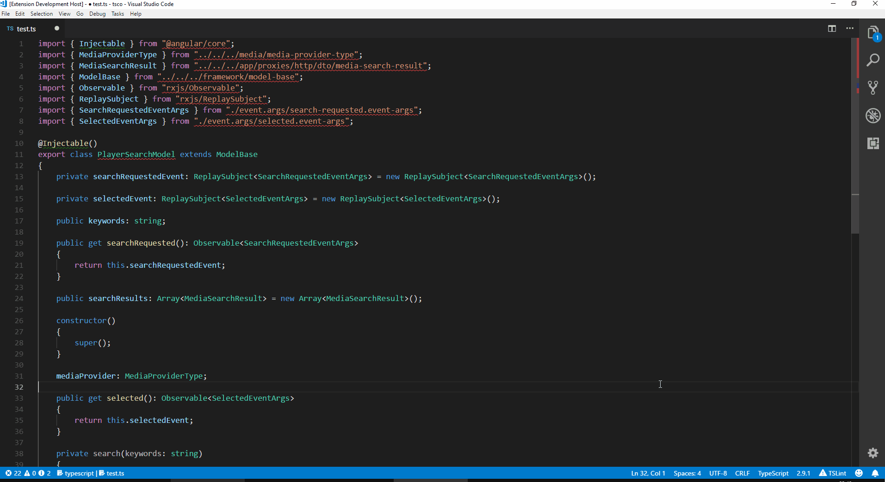
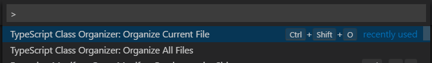
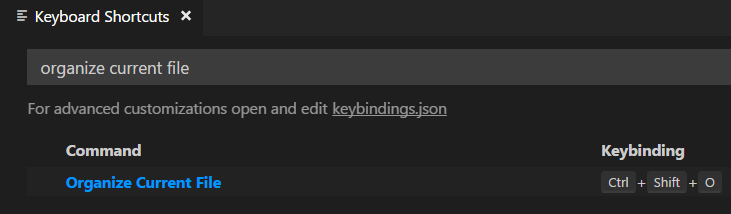
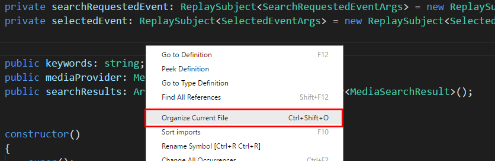

# TypeScript Class Organizer for VS Code

VS Code extension for keeping your TypeScript code organized by grouping and ordering class members.

## Features
Organize currently opened TypeScript file or all TypeScript files in your project.

## Usage

### Command Palette
From the command palette you can:

* organize current TypeScript file by invoking command "TypeScript Class Organizer: Organize Current File",
* organize all TypeScript files in the project by invoking command "TypeScript Class Organizer: Organize All Files"

### Shortcuts

You can invoke command "TypeScript Class Organizer: Organize Current File" by using the shortcut Ctr + Shift + O. You can change the shortcut by assigning a different shortcut to command "tsco.organize".

### Context menu

You can invoke command "TypeScript Class Organizer: Organize Current File" by using the context menu item.

## Configuration

Extensions supports the following configuration options:

* `tsco.useRegions`: When true regions surounding member groups are added. True by default.
* `tsco.addPublicModifierIfMissing`: When true public access modifier is added. True by default.
* `tsco.addRegionIdentation`: When true regions are idented with class members. True by default.
* `tsco.addRegionCaptionToRegionEnd`: When true region caption is added to region end as well. True by default.
* `tsco.groupPropertiesWithDecorators`: When true properties with decorators will come first. False by default.
* `tsco.addRowNumberInRegionName`: When true region children count added on title. True by default.
* `tsco.accessorsBeforeCtor`: When true put accessor before ctor during organization. False by default.

## Change log

### 1.0.0

* Initial release.

### 1.0.9

* added add public modifier if missing option
* added add region identation option
* added end region caption option
* added organiting type aliases, interfaces, classes and functions
* fixed issue with identation tabs / spaces
* fixed issue when comments were preceding class members
* fixed issue when decorators were preceding class members
* fixed issue with removing redundant empty lines
* updated referenced packages

### 1.0.10

* added group properties with decorators option

### 1.0.11

* fixed issue with duplicated regions
* addded grouping by decorator for all elements, not just properties when groupping by decorators
* added a new line between group with decorators and group without decorators when groupping by decorators

### 1.0.12

* removed limitation where extension can be activated only when not in debug mode
* fixed bug where redundant empty lines were not removed correctly
* fix bug where public access modifier was not added to methods

### 1.0.14

* added option of adding number of members within a region (courtesy of [pillont](https://github.com/pillont))
* added option to output accessors before constructor (courtesy of [pillont](https://github.com/pillont))
